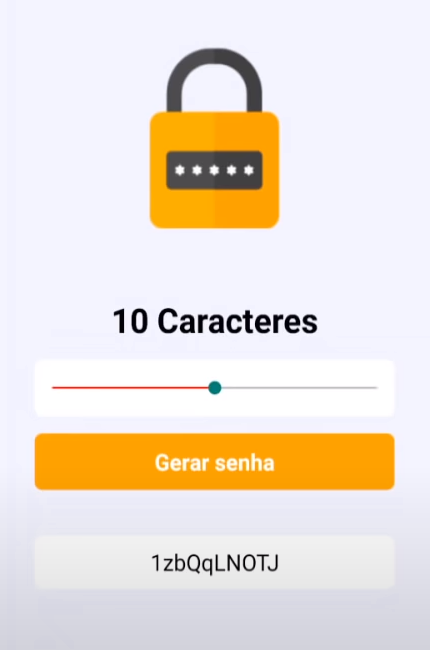

<h1 align="center">
  
</h1>

<p align="center">
  <a href="#-tecnologias">Tecnologias</a>&nbsp;&nbsp;&nbsp;|&nbsp;&nbsp;&nbsp;
  <a href="#-iniciando">Iniciando</a>&nbsp;&nbsp;&nbsp;|&nbsp;&nbsp;&nbsp;
  <a href="#-projeto">Projeto</a>&nbsp;&nbsp;&nbsp;|&nbsp;&nbsp;&nbsp;
  <a href="#memo-licença">Licença</a>
</p>

<p align="center">
 

  
</p>

<br>

<p align="center">
  
</p>

## 🧪 Tecnologias

Esse projeto foi desenvolvido com as seguintes tecnologias:

- EXPO
- JavaScript
- React
- ReactNative

## 🚀 Iniciando

Faça um clone do projeto e acesse a pasta

```bash
$ git clone https://github.com/danilocecci/gerador-de-senha.git && cd gerador-de-senha
```

Siga os passos abaixo
```bash
# Instale as dependências
$ expo init

# Inicie o projeto
$ expo start
```

## 💻 Projeto

O Gerador de Senha é uma ferramenta a fim de auxiliar o usuário na criação de senhas de segurança de alto nível. 
Desenvolvido durante o evento [React Native Insider](https://sujeitoprogramador.com/insider-1/) do [Sujeito Programador](https://www.youtube.com/c/Sujeitoprogramador/).


## :memo: Licença

Esse projeto está sob a licença MIT. Veja o arquivo [LICENSE](.github/LICENSE.md) para mais detalhes.

---

Feito com ♥ by danilocecci :wave:
